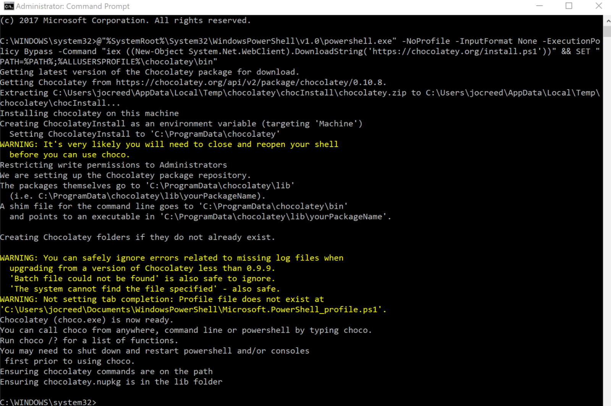
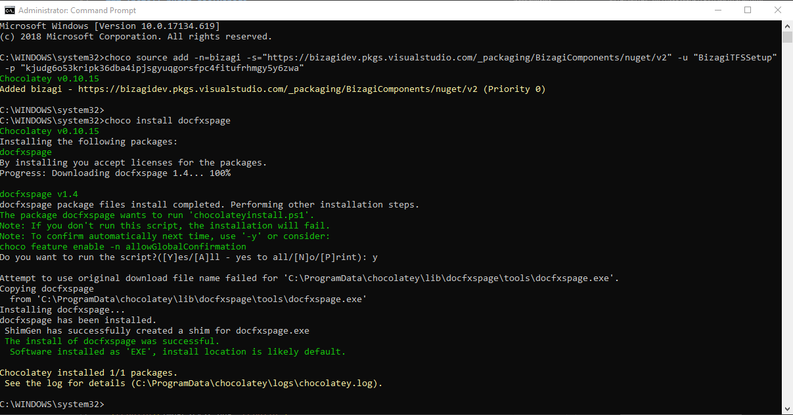
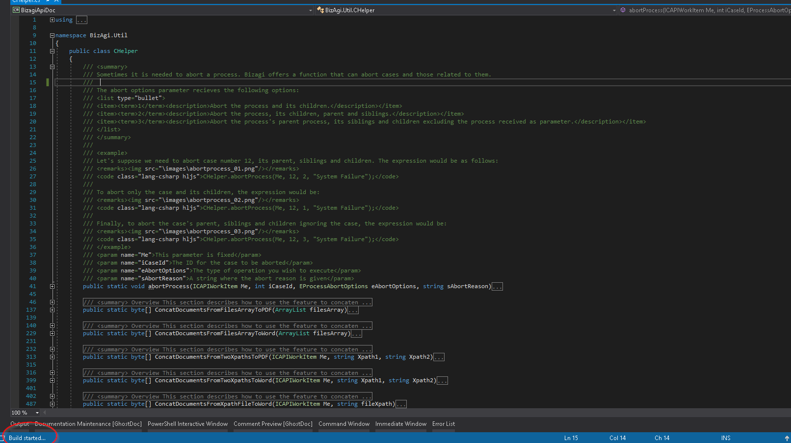
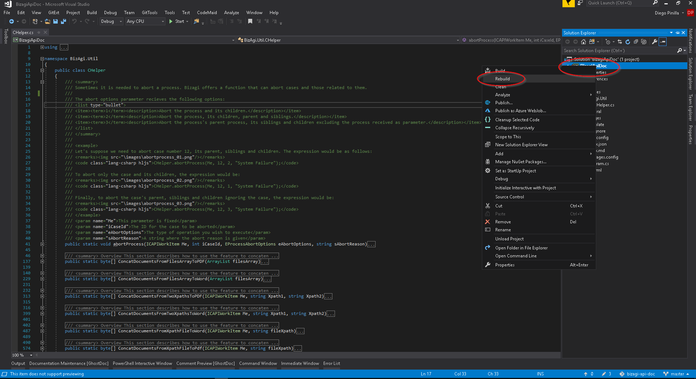
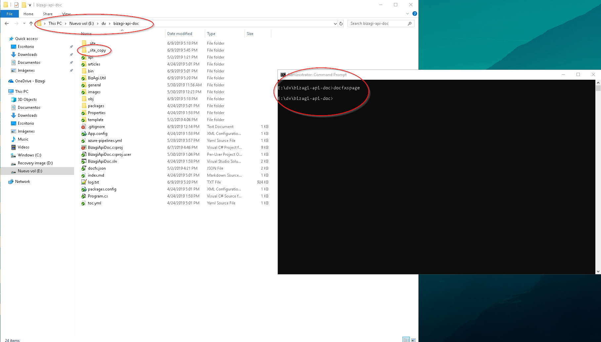

# Generate Technical API documentation


## Steps

### Install Chocolatey




### Install nuget docfxspage

```shell
choco install docfxspage
```



### Make changes to the documentation

1. Make the changes in the documentation, rebuild and wait a few seconds for the project is compiled

```shell
Ctrl+shift+B
```



```
Right click on the project and rebuild
```



### Generate files with the required format

```shell
docfxspage or docfxspage -z (using -z parameter creates  _site_copy.7z )
```
```
docfxspage
```
Verify site copy generation



    docfxspage -z


