**Development environment work instruction**
============================================

### **Local environment configuration**

#### **Go to the local folder**

Open the folder where you pasted the shared folder.

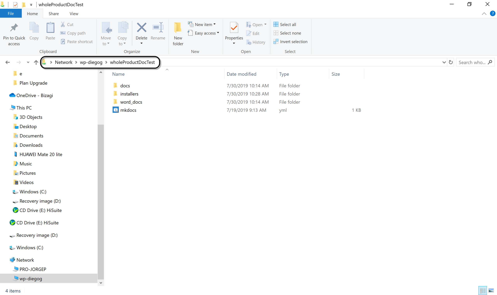

#### **Install Python**

Go to the folder installers and execute **python-3.7.4.exe.**

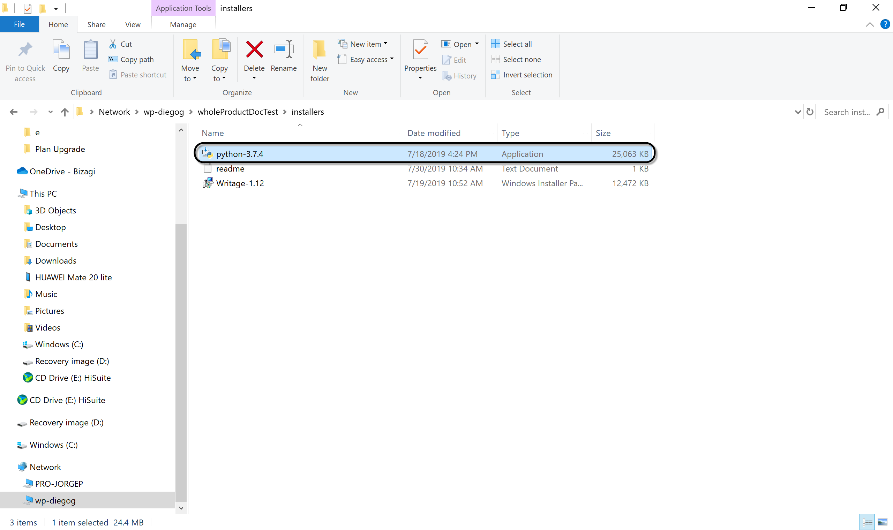

When prompted select Run.Then, follow the steps of the assistant

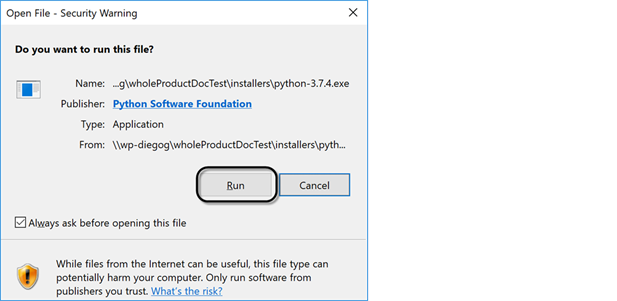

#### **Install required Python packages**

Open the file readme.txt to check the installation commands.

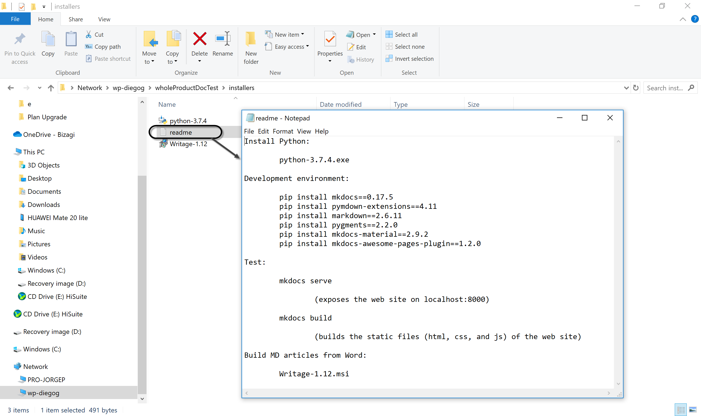

Open a command prompt to execute the installation commands.

Copy each command from the development environment section to the command prompt
and execute it.

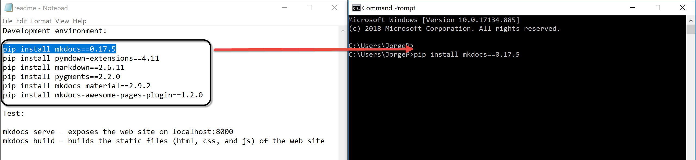

#### **Test the web site in the local environment**

From the command prompt, navigate to the folder with the local environment
settings (shared folder).

Execute the command *mkdocs serve* to test the web site.

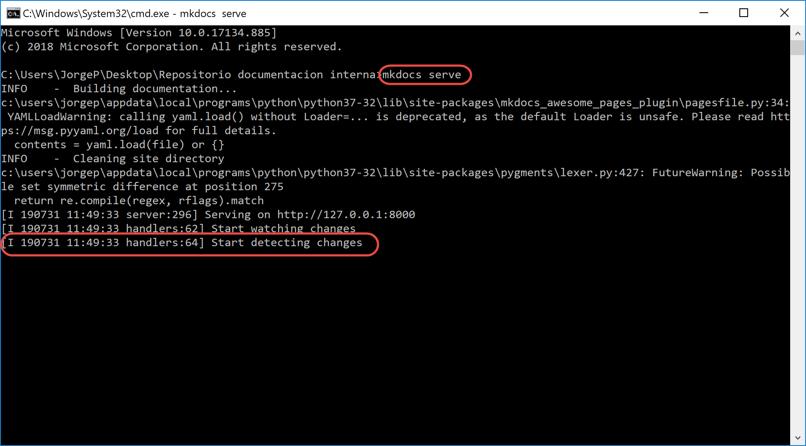

Once the message start detecting changes appears, open your browser, and go to
localhost:8000.

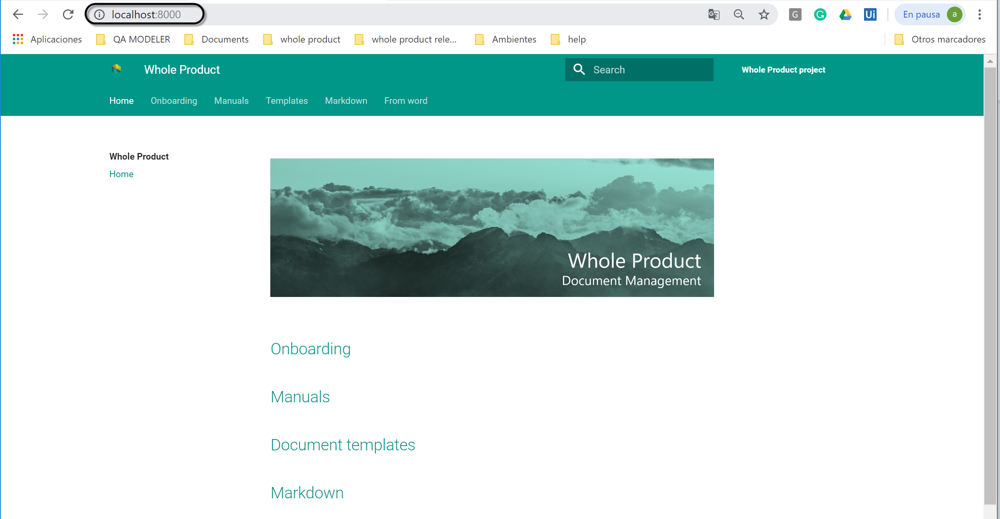

### **How to upload documents to the Whole Product document management site**

#### **Install Writage**

Writage is a Markdown extension that lets end users to create, edit, and update
Markdown document from Word.

Go to the path *shared folder/installers* and execute **Writage-1.12.msi**.

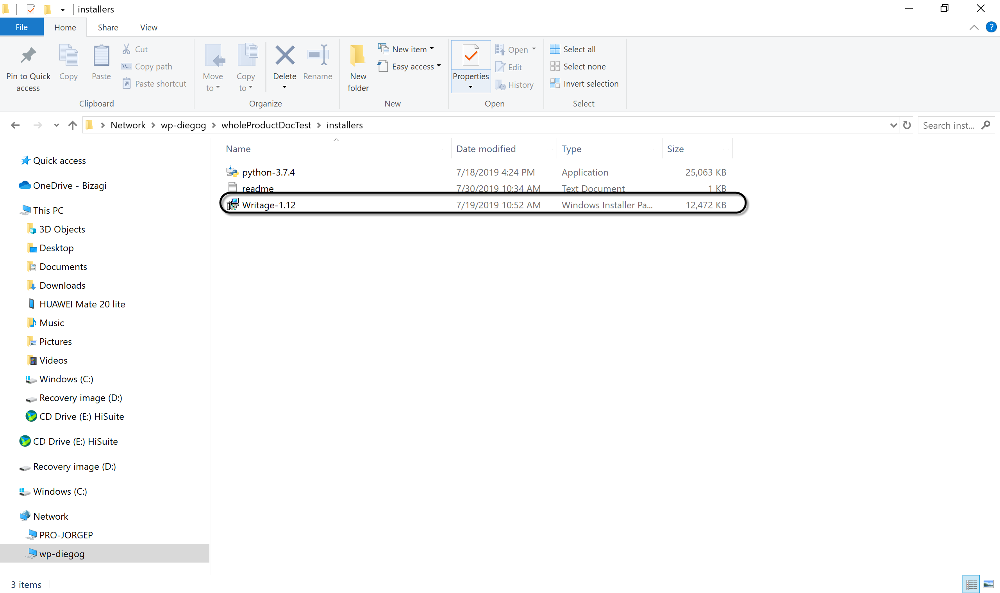

Click next and follow the steps of the wizard.

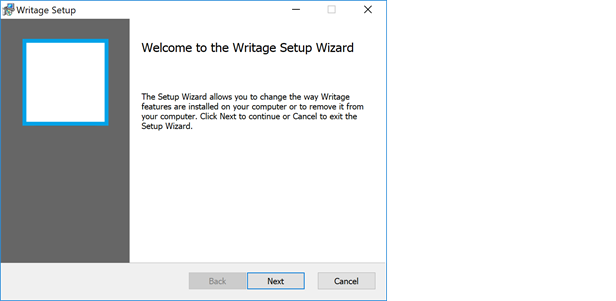

#### **Generate Markdown file**

Go to the path *shared folder/word_docs/Document Management/Document templates*,
select the template to edit.

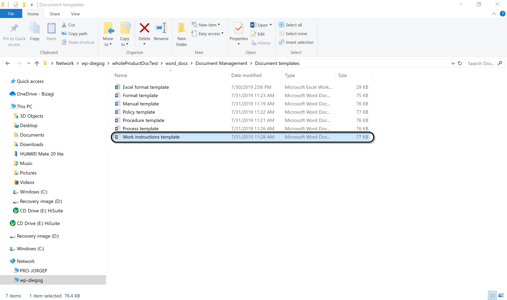

Save it in the folder **Document Management** as a Word document (docx).

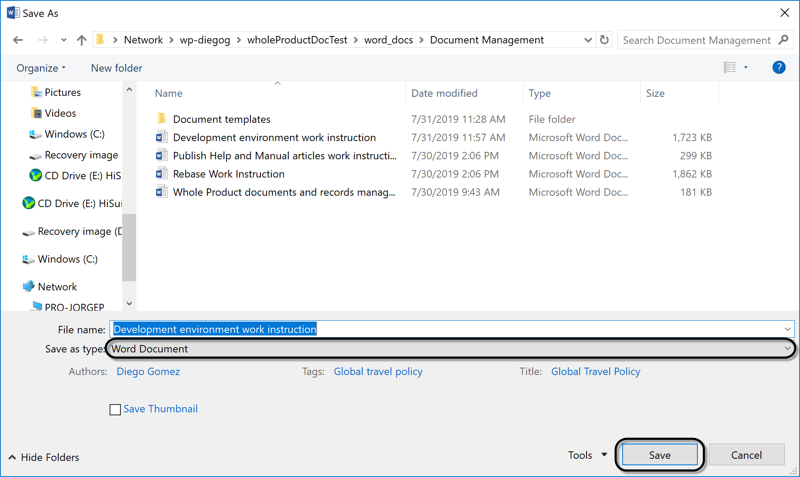

Save the document as a **Markdown** file in the folder where you want to publish
the article.

Keep in mind to save the file without blank spaces and in lower case. The name
of the fie defines the URL.

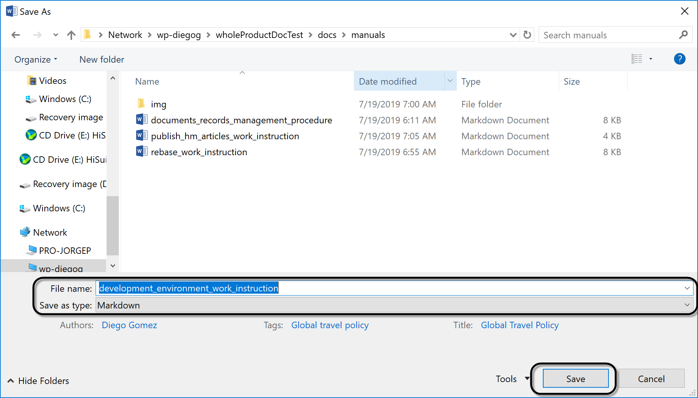

Close the document to test the web site.

#### **Test the article in the local environment**

Open a command prompt and navigate to the folder with the local environment
settings (shared folder).

Execute the command *mkdocs serve* to test the web site.

Once the message start detecting changes appears, open your browser, go to
localhost:8000, and navigate to the article location.

